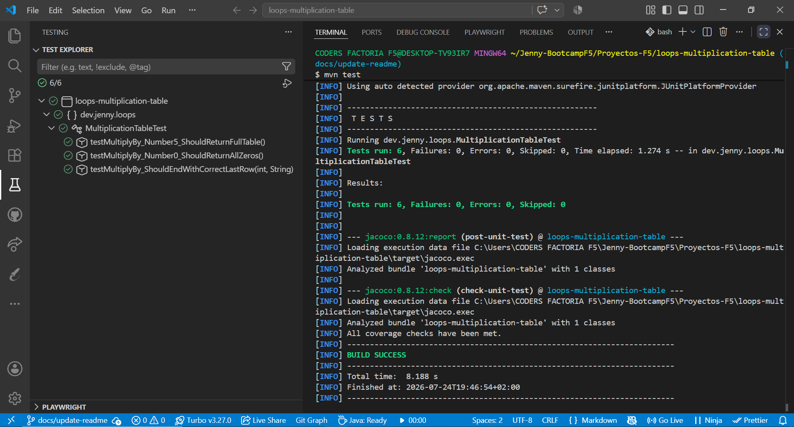
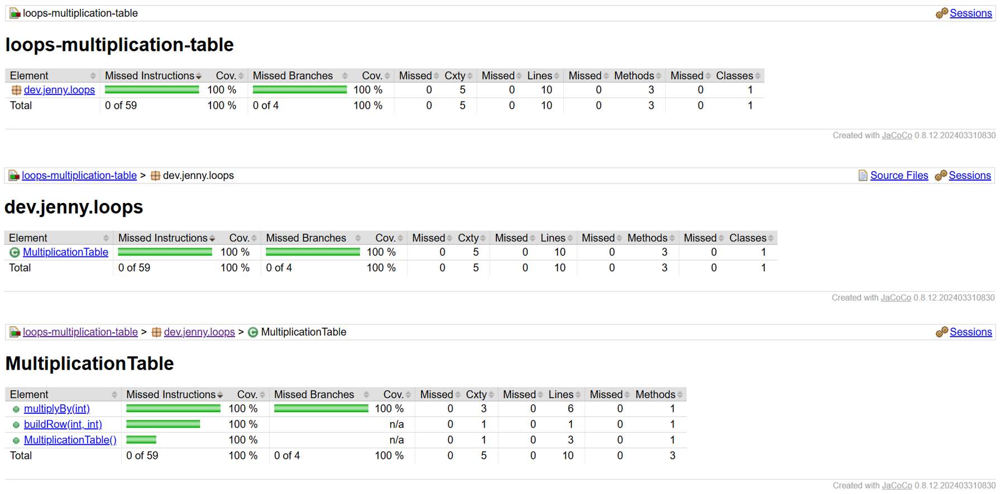

# 🔁 Loops – Tabla de Multiplicar en Java

> "La vida da muchas vueltas. Este bucle, exactamente diez."

Generación de la **tabla de multiplicar** de un número en Java 21 con Maven, siguiendo **TDD** (JUnit 5 + Hamcrest) y con cobertura de tests medida con JaCoCo.

---

## 📸 Vista rápida

|                   Tests                   |                    Cobertura                    |
| :---------------------------------------: | :---------------------------------------------: |
|  |  |

---

## 📑 Índice

- [Descripción](#-descripción)
- [Enunciado](#-enunciado)
- [Cómo reproducir el proyecto](#-cómo-reproducir-el-proyecto)
- [Testing](#-testing)
- [Cobertura de tests](#-cobertura-de-tests)
- [Estructura del repositorio](#-estructura-del-repositorio)
- [Tecnologías](#-tecnologías)
- [Recursos](#-recursos)
- [Autora](#-autora)

---

## 📋 Descripción

El objetivo de este proyecto es practicar **bucles** en Java generando la **tabla de multiplicar** de un número, aplicando **TDD** (Test-Driven Development). Cada funcionalidad sigue el ciclo completo, que puede seguirse paso a paso en el historial de commits:

🔴 **Red** — escribir primero un test que falla.
🟢 **Green** — escribir el código mínimo para que ese test pase.
🔵 **Refactor** — limpiar y mejorar el código, asegurándose de que los tests sigan pasando.

Se aplica **separación de responsabilidades**: una clase (`MultiplicationTable`) construye y **devuelve** la tabla como texto —lo que la hace testeable—, y otra (`App`) la presenta por consola.

Los requisitos principales son:

1. **Implementar una clase** con la responsabilidad de generar la tabla de multiplicar de un número.
2. **Testear la clase** de forma completa, cubriendo todos los escenarios.
3. **Alcanzar un coverage mínimo del 70 %.**
4. **Insertar una captura de la cobertura de tests** (coverage) en el README.

---

## 📝 Enunciado

Crea una clase que tenga la responsabilidad de crear la tabla de multiplicar de un número. Dado un número entero `n`, devuelve su tabla de multiplicar del 1 al 10. Cada múltiplo `n x i` (donde `1 <= i <= 10`) se muestra en una nueva línea con el formato: `n x i = resultado`.

**Ejemplo** — dado `n = 5`:

```text
5 x 1 = 5
5 x 2 = 10
5 x 3 = 15
5 x 4 = 20
5 x 5 = 25
5 x 6 = 30
5 x 7 = 35
5 x 8 = 40
5 x 9 = 45
5 x 10 = 50
```

**Requisitos de entrega:**

- La clase debe ser testeada.
- Coverage mínimo del **70 %**.
- Captura del coverage en el README.

---

## 🚀 Cómo reproducir el proyecto

### Requisitos previos

- JDK 21 instalado
- Apache Maven instalado y en el PATH
- Git para clonar el repositorio

### Pasos

```bash
# 1. Clonar el repositorio
git clone https://github.com/Jennydev-25/loops-multiplication-table.git
cd loops-multiplication-table

# 2. Ejecutar los tests (genera además el reporte de cobertura de JaCoCo)
mvn test
```

El reporte de cobertura se genera en `target/site/jacoco/index.html`, que puedes abrir en el navegador.

Para **ejecutar la aplicación** e imprimir la tabla por consola (sin argumentos usa el 5; con un argumento, el número que le pases):

```bash
java -cp target/classes dev.jenny.loops.App        # tabla del 5 (por defecto)
java -cp target/classes dev.jenny.loops.App 7      # tabla del 7
```

---

## 🧪 Testing

Siguiendo la metodología TDD, la clase `MultiplicationTable` se testea cubriendo todos sus escenarios con **JUnit 5 + Hamcrest**. Los tests comparten una misma instancia creada en el método `setUp()` anotado con `@BeforeEach`, e incluyen un test **parametrizado** (`@ParameterizedTest`):

| Test                                           | Escenario                                                 |
| ---------------------------------------------- | --------------------------------------------------------- |
| `testMultiplyBy_Number5_ShouldReturnFullTable` | Devuelve la tabla completa del 5 (ejemplo del enunciado)  |
| `testMultiplyBy_Number0_ShouldReturnAllZeros`  | Devuelve la tabla del 0 (caso borde)                      |
| `testMultiplyBy_ShouldEndWithCorrectLastRow`   | Verifica la última fila para varios números (1, 2, 7, 10) |


---

## 📊 Cobertura de tests (coverage)

Reporte generado con **JaCoCo** tras ejecutar `mvn test`. El informe HTML se encuentra en `target/site/jacoco/index.html`. La clase `App` (presentación) se excluye de la medición, por lo que el coverage refleja la lógica al **100 %**.

| Métrica       | Cobertura |
| ------------- | --------- |
| Instrucciones | 100 %     |
| Ramas         | 100 %     |
| Líneas        | 100 %     |
| Métodos       | 100 %     |


---

## 📁 Estructura del repositorio

```text
loops-multiplication-table/
├── assets/
│   └── images/
│       ├── test-explorer.png
│       └── coverage-jacoco.png
├── src/
│   ├── main/java/dev/jenny/loops/
│   │   ├── App.java
│   │   └── MultiplicationTable.java
│   └── test/java/dev/jenny/loops/
│       └── MultiplicationTableTest.java
├── .gitignore
├── pom.xml
└── README.md
```

---

## 🛠️ Tecnologías

- **[Java 21](https://www.oracle.com/java/technologies/downloads/)** — Lenguaje de programación del proyecto
- **[Apache Maven](https://maven.apache.org/)** — Gestor de dependencias y construcción del proyecto
- **[JUnit 5](https://junit.org/junit5/)** — Framework de tests unitarios
- **[Hamcrest](https://hamcrest.org/JavaHamcrest/)** — Librería de _matchers_ para aserciones legibles (`assertThat`)
- **[JaCoCo](https://www.jacoco.org/jacoco/)** — Medición de la cobertura de tests
- **[Visual Studio Code](https://code.visualstudio.com/)** — Editor usado para desarrollar y gestionar el proyecto
- **[Markdown](https://www.markdownguide.org/)** — Lenguaje de marcado para el README
- **[Git](https://git-scm.com/)** / **[GitHub](https://github.com/)** — Control de versiones y alojamiento del proyecto

---

## 📚 Recursos

- **[Java Naming Conventions (Oracle)](https://www.oracle.com/java/technologies/javase/codeconventions-namingconventions.html)** — Convenciones de nomenclatura de Java
- **[JUnit 5 User Guide](https://junit.org/junit5/docs/current/user-guide/)** — Documentación oficial de JUnit 5
- **[JUnit 5 – Parameterized Tests](https://junit.org/junit5/docs/current/user-guide/#writing-tests-parameterized-tests)** — Tests parametrizados
- **[Hamcrest – JavaHamcrest](https://hamcrest.org/JavaHamcrest/)** — Documentación de los matchers de Hamcrest
- **[JaCoCo Maven Plugin](https://www.jacoco.org/jacoco/trunk/doc/maven.html)** — Documentación del plugin de cobertura

---

## 👩‍💻 Autora

**[Jenny Sánchez Requejo](https://github.com/Jennydev-25)**
